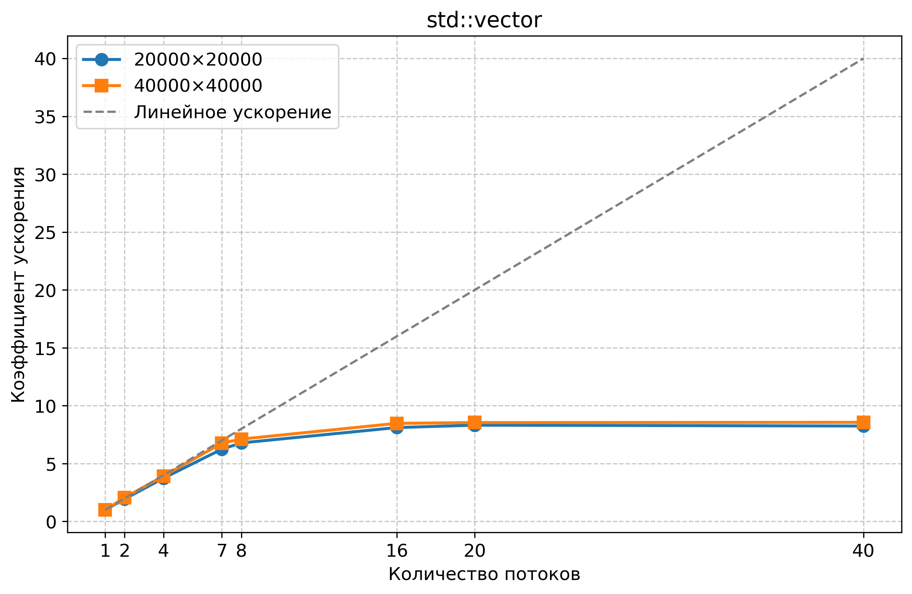
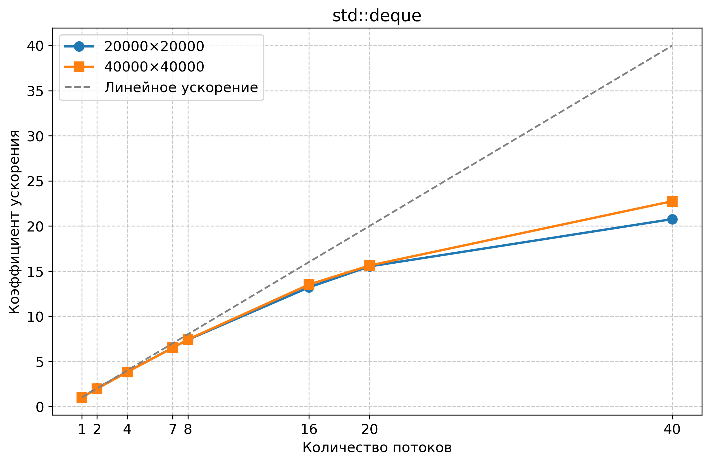

## Лабораторная работа №2
 
### 1: std::vector
Тестирование проводилось для двух размеров матриц:  
- **20000×20000** (~3 GiB) 
- **40000×40000** (~12 GiB)

#### Таблица результатов: 

| Размер матрицы | Потоки | Время (сек) | Ускорение (Sₚ) |
|----------------|--------|------------|---------------|
| 20000×20000    | 1      | 1.1365     | 1.00          |
|                | 2      | 0.5852     | 1.94          |
|                | 4      | 0.3039     | 3.74          |
|                | 8      | 0.1675     | 6.79         |
|                | 16     | 0.1401     | 8.11         |
|                | 20     | 0.1366     | 8.32          |
|                | 40     | 0.1379     | 8.24         |
|ㅤ|ㅤ|ㅤ|ㅤ|
| 40000×40000    | 1      | 4.6159     | 1.00          |
|                | 2      | 2.2452     | 2.06          |
|                | 4      | 1.1747     | 3.93          |
|                | 8      | 0.6486     | 7.12          |
|                | 16     | 0.5446     | 8.48         |
|                | 20     | 0.5403     | 8.54        |
|                | 40     | 0.5391     | 8.56         |

---

### 2: std::deque
#### Таблица результатов: 

| Размер матрицы | Потоки | Время (сек) | Ускорение (Sₚ) |
|----------------|--------|------------|---------------|
| 20000×20000    | 1      | 4.7807     | 1.00          |
|                | 2      | 2.3574     | 2.03          |
|                | 4      | 1.2438     | 3.84          |
|                | 8      | 0.6471     | 7.39         |
|                | 16     | 0.3622    | 13.20         |
|                | 20     | 0.3080     | 15.52          |
|                | 40     | 0.2303     | 20.76         |
|ㅤ|ㅤ|ㅤ|ㅤ|
| 40000×40000    | 1      | 18.7433     | 1.00          |
|                | 2      | 9.5424     | 1.96          |
|                | 4      | 4.9113     | 3.82          |
|                | 8      | 2.5246    | 7.42          |
|                | 16     | 1.3871     | 13.51         |
|                | 20     | 1.1999     | 15.62        |
|                | 40     | 0.8239     | 22.75         |

---

- Оба контейнера показывают хорошую масштабируемость, но std::deque показал лучшие результаты для данной задачи, особенно на больших размерах матриц.

- Оптимальное количество потоков для данной системы - 16-20, дальнейшее увеличение дает меньший прирост.

- Для задач с интенсивными вычислениями и большими объемами данных контейнер deque может быть предпочтительнее чем vector.
